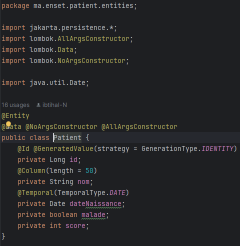

<h1>Compte rendu</h1>

<h4>Installer IntelliJ Ultimate</h4>
<h4>Créer un projet Spring Initializer avec les dépendances JPA, H2, Spring Web et Lombock</h4>
<h4>3. Créer l'entité JPA Patient </h4>

<h4>4. Configurer l'unité de persistance dans le ficher application.properties </h4>

<h4>5. Créer l'interface JPA Repository basée sur Spring data</h4>

<h4>6. Tester quelques opérations de gestion de patients :</h4>

<h4>7. Migrer de H2 Database vers MySQL</h4>

